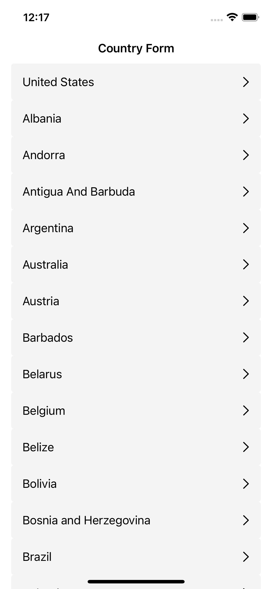
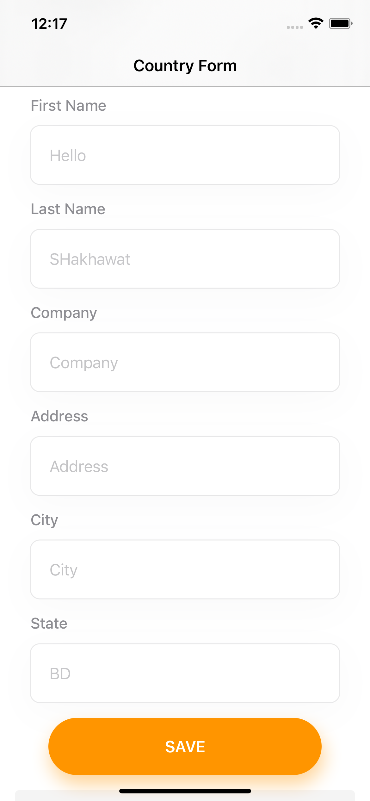
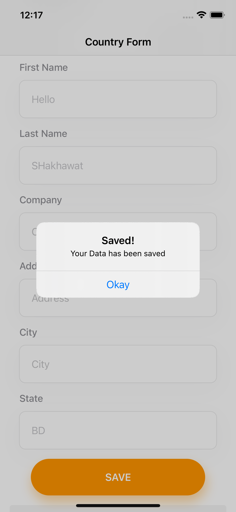

# Country Form Practical Test
This is Practical Test project for Doodle Inc. 
There was a country list API Given in the test. After Parsing the json data from the API
there was some dynamic fields names given in the API. Based on those filed I've designed a form where user
can input their information. After giving all the informations When user Taps on
the SAVE Button, all the informations are saved in the local database as JSON format.
Data will be automatically fetched when when reopen the App later.


## Screenshots

  


## Deployment

To clone this project use this link. 

```bash
  https://github.com/Shakhawat-dev/Doodle-Country-Practice-Test.git
```
